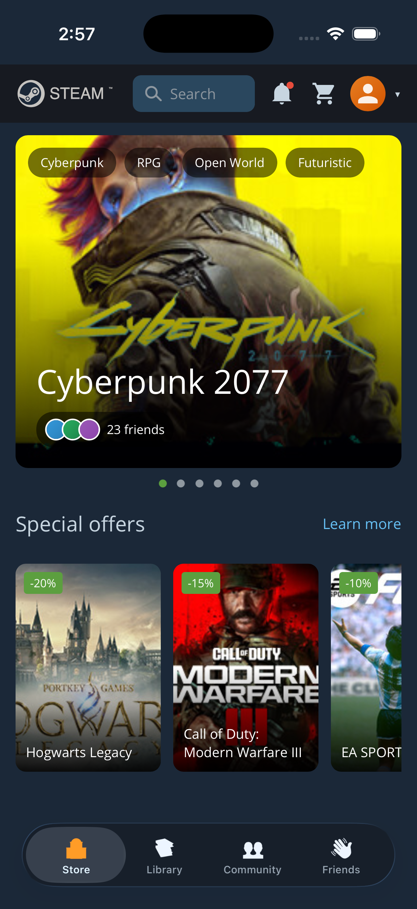
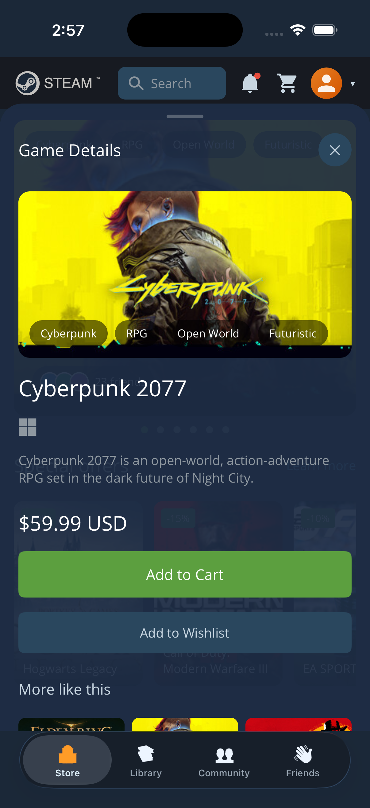
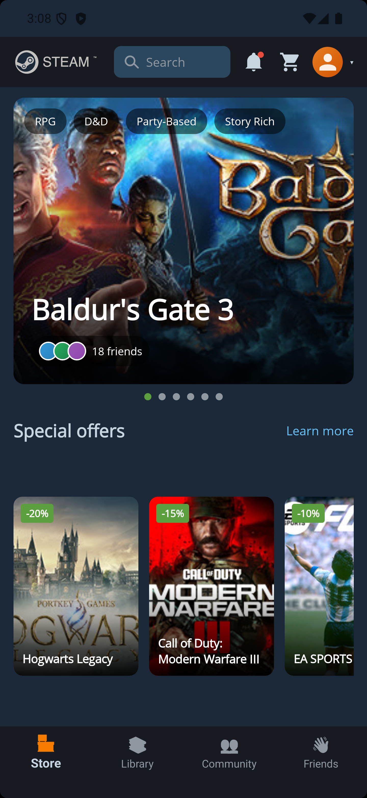
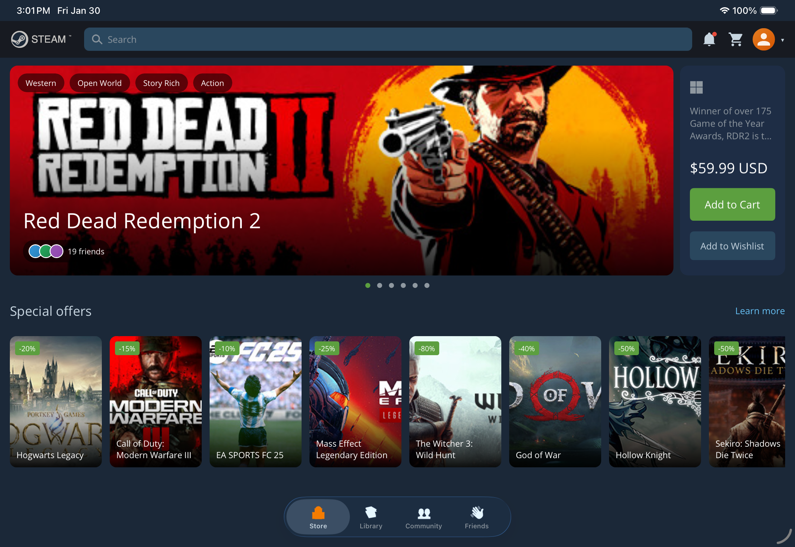

# MauiSteamApp

A .NET MAUI mobile application demonstrating "vibe coding" - rapid UI development using GitHub Copilot. This project showcases a Steam Store mockup interface built entirely through AI-assisted development.

## About

This is an experiment in vibe coding, exploring how quickly a mobile app can be built using GitHub Copilot (mostly from VS Code Copilot Chat). The project started with a simple prompt:

> "Make a mobile app based on a screenshot of vibe-wpf"

The app is based on [vibe-wpf](https://github.com/jonathanpeppers/vibe-wpf) by Jonathan Peppers, which itself implements the [Steam Desktop App Redesign](https://dribbble.com/shots/20659983-Steam-Desktop-App-Redesign) by [Juxtopposed](https://dribbble.com/Juxtopposed) on Dribbble.

## Screenshots

| iOS | iOS (Game Details) | Android |
|:---:|:------------------:|:-------:|
|  |  |  |

| iPad |
|:----:|
|  |

## Features

- **Steam Store UI Mockup**: A mobile recreation of the Steam Store interface
- **Cross-Platform**: Targets iOS, Android, and macOS (via Mac Catalyst)
- **AI-Assisted Development**: Built primarily through natural language prompts to GitHub Copilot
- **Modern MAUI UI**: Demonstrates XAML layouts, custom controls, and responsive design

## Target Platforms

| Platform | Minimum Version |
|----------|-----------------|
| iOS | 15.0 |
| Android | 21.0 |
| macOS (Catalyst) | 15.0 |
| Windows | 10.0.17763.0 |

## Attribution

### Design Chain

This project's design has the following attribution chain:

1. **Original Design**: [Steam Desktop App Redesign](https://dribbble.com/shots/20659983-Steam-Desktop-App-Redesign) by [Juxtopposed](https://dribbble.com/Juxtopposed) on Dribbble
2. **WPF Implementation**: [vibe-wpf](https://github.com/jonathanpeppers/vibe-wpf) by Jonathan Peppers
3. **MAUI Implementation**: This project (MauiSteamApp)

### Trademarks

All game titles, logos, and brand imagery are property of their respective owners. This is a UI mockup for demonstration purposes only.

## Technologies

- [.NET MAUI](https://dotnet.microsoft.com/apps/maui) - Cross-platform UI framework
- .NET 10.0
- C# / XAML
- GitHub Copilot (VS Code)
